# TPC-DS Join Graphs and Topologies

This artifact details the exact Mermaid diagram join graph and structural topology classification (Star, Chain, Tree, etc.) for each flat query.

### query10
- **Tables:** 7
- **Structure:** Cyclic / Web

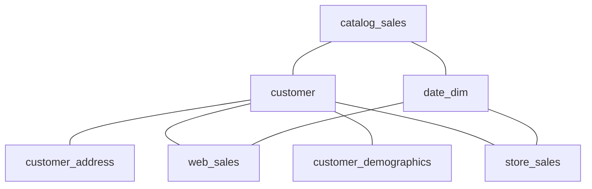

### query12
- **Tables:** 3
- **Structure:** Star

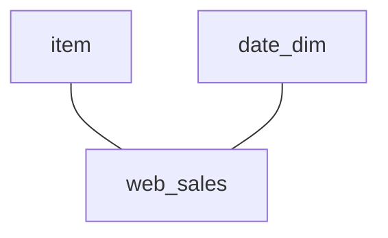

### query15
- **Tables:** 4
- **Structure:** Chain

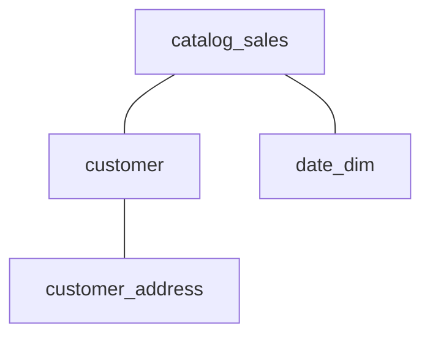

### query17
- **Tables:** 6
- **Structure:** Cyclic / Web

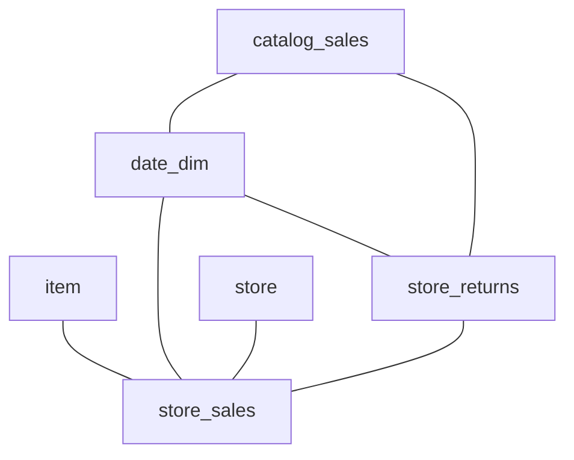

### query18
- **Tables:** 6
- **Structure:** Cyclic / Web

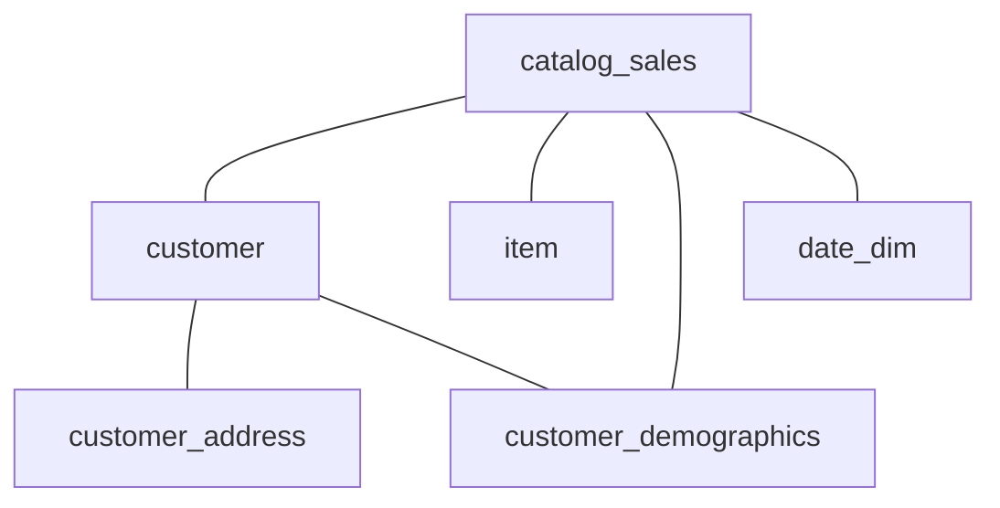

### query20
- **Tables:** 3
- **Structure:** Star

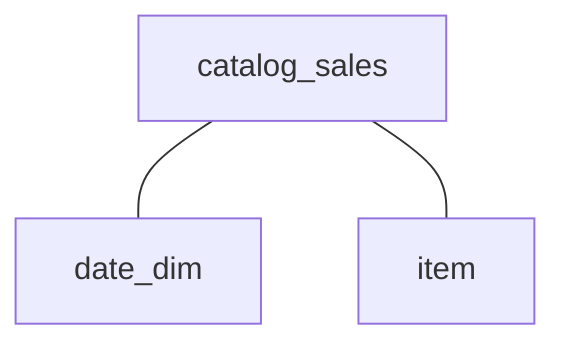

### query21
- **Tables:** 4
- **Structure:** Star

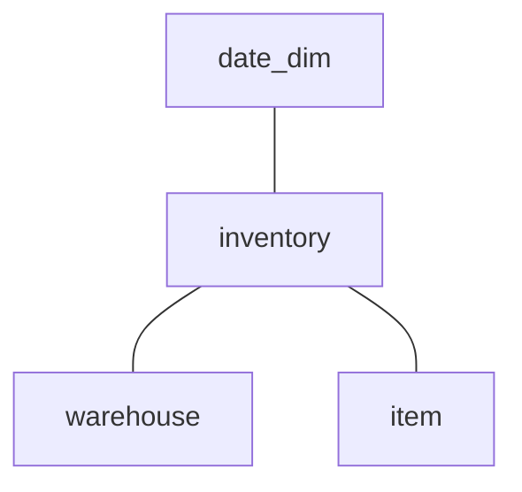

### query22
- **Tables:** 3
- **Structure:** Star

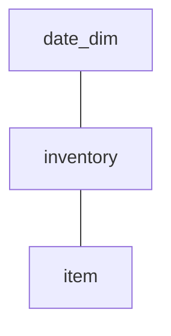

### query23
- **Tables:** 6
- **Structure:** Cyclic / Web

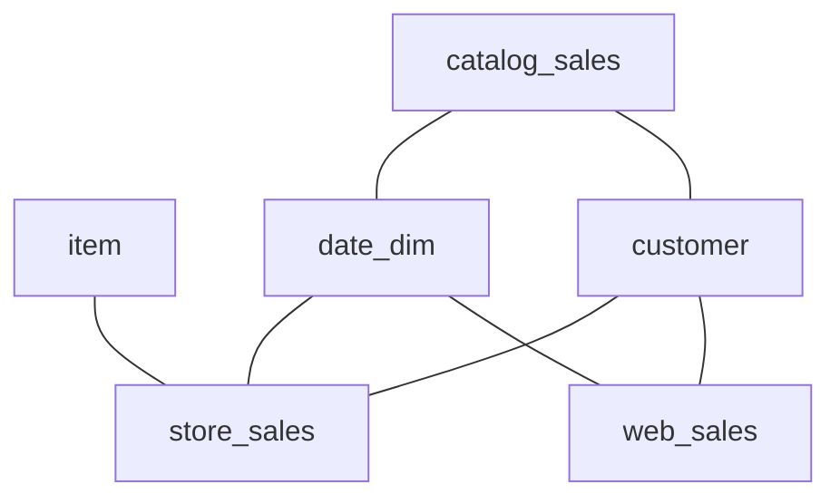

### query25
- **Tables:** 6
- **Structure:** Cyclic / Web


### query26
- **Tables:** 5
- **Structure:** Star

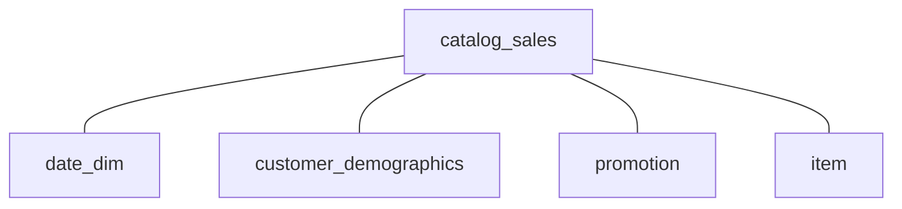

### query27
- **Tables:** 5
- **Structure:** Star

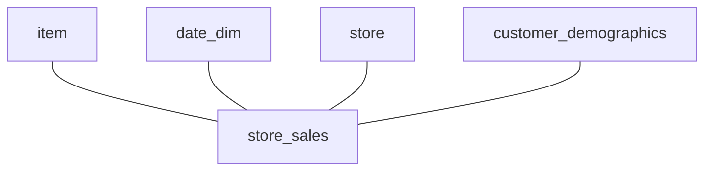

### query29
- **Tables:** 6
- **Structure:** Cyclic / Web


### query3
- **Tables:** 3
- **Structure:** Star

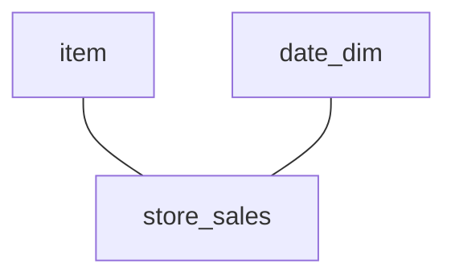

### query30
- **Tables:** 4
- **Structure:** Chain

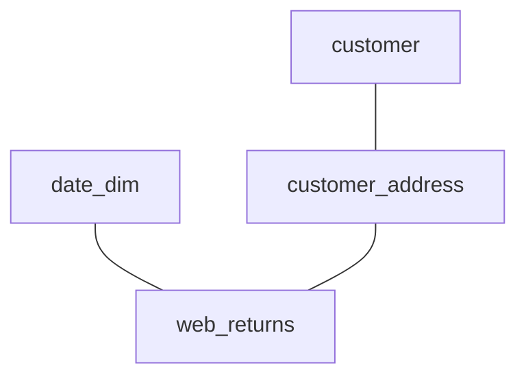

### query31
- **Tables:** 4
- **Structure:** Cyclic / Web

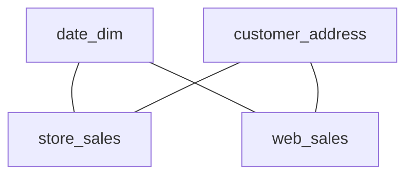

### query32
- **Tables:** 3
- **Structure:** Star


### query33
- **Tables:** 6
- **Structure:** Cyclic / Web

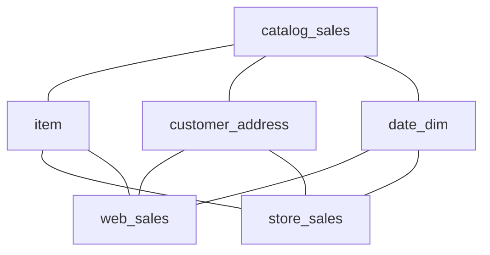

### query34
- **Tables:** 5
- **Structure:** Star

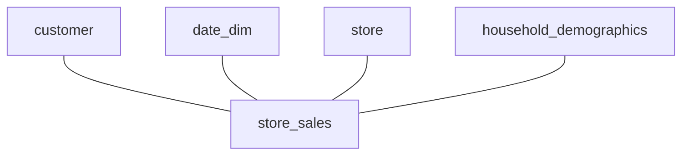

### query35
- **Tables:** 7
- **Structure:** Cyclic / Web


### query36
- **Tables:** 4
- **Structure:** Star

```mermaid
graph TD;
  item --- store_sales
  date_dim --- store_sales
  store --- store_sales
```

### query37
- **Tables:** 4
- **Structure:** Chain

```mermaid
graph TD;
  date_dim --- inventory
  inventory --- item
  catalog_sales --- item
```

### query38
- **Tables:** 5
- **Structure:** Cyclic / Web

```mermaid
graph TD;
  date_dim --- web_sales
  catalog_sales --- customer
  customer --- web_sales
  date_dim --- store_sales
  customer --- store_sales
  catalog_sales --- date_dim
```

### query39
- **Tables:** 4
- **Structure:** Star

```mermaid
graph TD;
  inventory --- warehouse
  date_dim --- inventory
  inventory --- item
```

### query40
- **Tables:** 5
- **Structure:** Star

```mermaid
graph TD;
  catalog_returns --- catalog_sales
  catalog_sales --- warehouse
  catalog_sales --- date_dim
  catalog_sales --- item
```

### query42
- **Tables:** 3
- **Structure:** Star

```mermaid
graph TD;
  item --- store_sales
  date_dim --- store_sales
```

### query43
- **Tables:** 3
- **Structure:** Star

```mermaid
graph TD;
  date_dim --- store_sales
  store --- store_sales
```

### query45
- **Tables:** 5
- **Structure:** Tree

```mermaid
graph TD;
  item --- web_sales
  date_dim --- web_sales
  customer --- customer_address
  customer --- web_sales
```

### query49
- **Tables:** 7
- **Structure:** Tree

```mermaid
graph TD;
  date_dim --- web_sales
  web_returns --- web_sales
  catalog_returns --- catalog_sales
  date_dim --- store_sales
  store_returns --- store_sales
  catalog_sales --- date_dim
```

### query50
- **Tables:** 4
- **Structure:** Cyclic / Web

```mermaid
graph TD;
  date_dim --- store_sales
  store --- store_sales
  store_returns --- store_sales
  date_dim --- store_returns
```

### query52
- **Tables:** 3
- **Structure:** Star

```mermaid
graph TD;
  item --- store_sales
  date_dim --- store_sales
```

### query53
- **Tables:** 4
- **Structure:** Star

```mermaid
graph TD;
  item --- store_sales
  date_dim --- store_sales
  store --- store_sales
```

### query55
- **Tables:** 3
- **Structure:** Star

```mermaid
graph TD;
  item --- store_sales
  date_dim --- store_sales
```

### query56
- **Tables:** 6
- **Structure:** Cyclic / Web

```mermaid
graph TD;
  item --- store_sales
  date_dim --- web_sales
  catalog_sales --- item
  date_dim --- store_sales
  customer_address --- web_sales
  customer_address --- store_sales
  item --- web_sales
  catalog_sales --- customer_address
  catalog_sales --- date_dim
```

### query58
- **Tables:** 5
- **Structure:** Cyclic / Web

```mermaid
graph TD;
  item --- store_sales
  date_dim --- web_sales
  catalog_sales --- item
  date_dim --- store_sales
  item --- web_sales
  catalog_sales --- date_dim
```

### query60
- **Tables:** 6
- **Structure:** Cyclic / Web

```mermaid
graph TD;
  item --- store_sales
  date_dim --- web_sales
  catalog_sales --- item
  date_dim --- store_sales
  customer_address --- web_sales
  customer_address --- store_sales
  item --- web_sales
  catalog_sales --- customer_address
  catalog_sales --- date_dim
```

### query61
- **Tables:** 7
- **Structure:** Tree

```mermaid
graph TD;
  item --- store_sales
  customer --- customer_address
  date_dim --- store_sales
  promotion --- store_sales
  customer --- store_sales
  store --- store_sales
```

### query62
- **Tables:** 5
- **Structure:** Star

```mermaid
graph TD;
  web_sales --- web_site
  ship_mode --- web_sales
  date_dim --- web_sales
  warehouse --- web_sales
```

### query63
- **Tables:** 4
- **Structure:** Star

```mermaid
graph TD;
  item --- store_sales
  date_dim --- store_sales
  store --- store_sales
```

### query66
- **Tables:** 6
- **Structure:** Cyclic / Web

```mermaid
graph TD;
  date_dim --- web_sales
  time_dim --- web_sales
  warehouse --- web_sales
  catalog_sales --- date_dim
  catalog_sales --- time_dim
  ship_mode --- web_sales
  catalog_sales --- ship_mode
  catalog_sales --- warehouse
```

### query69
- **Tables:** 7
- **Structure:** Cyclic / Web

```mermaid
graph TD;
  date_dim --- web_sales
  customer --- customer_address
  customer --- web_sales
  catalog_sales --- customer
  date_dim --- store_sales
  customer --- store_sales
  customer --- customer_demographics
  catalog_sales --- date_dim
```

### query7
- **Tables:** 5
- **Structure:** Star

```mermaid
graph TD;
  date_dim --- store_sales
  item --- store_sales
  promotion --- store_sales
  customer_demographics --- store_sales
```

### query72
- **Tables:** 9
- **Structure:** Cyclic / Web

```mermaid
graph TD;
  inventory --- warehouse
  date_dim --- inventory
  catalog_sales --- inventory
  catalog_sales --- item
  catalog_returns --- catalog_sales
  catalog_sales --- customer_demographics
  catalog_sales --- household_demographics
  catalog_sales --- promotion
  catalog_sales --- date_dim
```

### query73
- **Tables:** 5
- **Structure:** Star

```mermaid
graph TD;
  customer --- store_sales
  date_dim --- store_sales
  store --- store_sales
  household_demographics --- store_sales
```

### query74
- **Tables:** 4
- **Structure:** Cyclic / Web

```mermaid
graph TD;
  date_dim --- store_sales
  date_dim --- web_sales
  customer --- store_sales
  customer --- web_sales
```

### query75
- **Tables:** 8
- **Structure:** Cyclic / Web

```mermaid
graph TD;
  item --- store_sales
  date_dim --- web_sales
  web_returns --- web_sales
  catalog_sales --- item
  catalog_returns --- catalog_sales
  date_dim --- store_sales
  item --- web_sales
  store_returns --- store_sales
  catalog_sales --- date_dim
```

### query77
- **Tables:** 9
- **Structure:** Cyclic / Web

```mermaid
graph TD;
  date_dim --- web_sales
  catalog_returns --- date_dim
  store --- store_returns
  date_dim --- store_sales
  web_page --- web_returns
  date_dim --- store_returns
  web_page --- web_sales
  date_dim --- web_returns
  store --- store_sales
  catalog_sales --- date_dim
```

### query79
- **Tables:** 5
- **Structure:** Star

```mermaid
graph TD;
  customer --- store_sales
  date_dim --- store_sales
  store --- store_sales
  household_demographics --- store_sales
```

### query80
- **Tables:** 12
- **Structure:** Cyclic / Web

```mermaid
graph TD;
  web_sales --- web_site
  item --- store_sales
  promotion --- web_sales
  date_dim --- web_sales
  web_returns --- web_sales
  catalog_sales --- item
  catalog_returns --- catalog_sales
  promotion --- store_sales
  date_dim --- store_sales
  catalog_page --- catalog_sales
  catalog_sales --- promotion
  item --- web_sales
  store --- store_sales
  store_returns --- store_sales
  catalog_sales --- date_dim
```

### query81
- **Tables:** 4
- **Structure:** Chain

```mermaid
graph TD;
  catalog_returns --- customer_address
  catalog_returns --- date_dim
  customer --- customer_address
```

### query82
- **Tables:** 4
- **Structure:** Chain

```mermaid
graph TD;
  date_dim --- inventory
  item --- store_sales
  inventory --- item
```

### query83
- **Tables:** 5
- **Structure:** Cyclic / Web

```mermaid
graph TD;
  catalog_returns --- date_dim
  catalog_returns --- item
  item --- store_returns
  date_dim --- store_returns
  item --- web_returns
  date_dim --- web_returns
```

### query84
- **Tables:** 6
- **Structure:** Tree

```mermaid
graph TD;
  customer --- household_demographics
  customer --- customer_address
  customer_demographics --- store_returns
  household_demographics --- income_band
  customer --- customer_demographics
```

### query85
- **Tables:** 7
- **Structure:** Tree

```mermaid
graph TD;
  date_dim --- web_sales
  web_returns --- web_sales
  customer_address --- web_returns
  customer_demographics --- web_returns
  reason --- web_returns
  web_page --- web_sales
```

### query86
- **Tables:** 3
- **Structure:** Star

```mermaid
graph TD;
  item --- web_sales
  date_dim --- web_sales
```

### query87
- **Tables:** 5
- **Structure:** Cyclic / Web

```mermaid
graph TD;
  date_dim --- web_sales
  catalog_sales --- customer
  customer --- web_sales
  date_dim --- store_sales
  customer --- store_sales
  catalog_sales --- date_dim
```

### query88
- **Tables:** 4
- **Structure:** Star

```mermaid
graph TD;
  store_sales --- time_dim
  store --- store_sales
  household_demographics --- store_sales
```

### query89
- **Tables:** 4
- **Structure:** Star

```mermaid
graph TD;
  item --- store_sales
  date_dim --- store_sales
  store --- store_sales
```

### query90
- **Tables:** 4
- **Structure:** Star

```mermaid
graph TD;
  time_dim --- web_sales
  household_demographics --- web_sales
  web_page --- web_sales
```

### query91
- **Tables:** 7
- **Structure:** Tree

```mermaid
graph TD;
  customer --- household_demographics
  call_center --- catalog_returns
  customer --- customer_address
  catalog_returns --- customer
  catalog_returns --- date_dim
  customer --- customer_demographics
```

### query92
- **Tables:** 3
- **Structure:** Star

```mermaid
graph TD;
  item --- web_sales
  date_dim --- web_sales
```

### query93
- **Tables:** 3
- **Structure:** Star

```mermaid
graph TD;
  reason --- store_returns
  store_returns --- store_sales
```

### query96
- **Tables:** 4
- **Structure:** Star

```mermaid
graph TD;
  store_sales --- time_dim
  store --- store_sales
  household_demographics --- store_sales
```

### query97
- **Tables:** 3
- **Structure:** Star

```mermaid
graph TD;
  date_dim --- store_sales
  catalog_sales --- date_dim
```

### query98
- **Tables:** 3
- **Structure:** Star

```mermaid
graph TD;
  item --- store_sales
  date_dim --- store_sales
```

### query99
- **Tables:** 5
- **Structure:** Star

```mermaid
graph TD;
  call_center --- catalog_sales
  catalog_sales --- ship_mode
  catalog_sales --- warehouse
  catalog_sales --- date_dim
```
